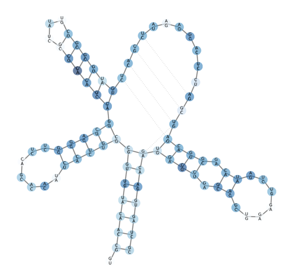

# RaSE
RaSE - RNA structurAl Stability Estimator

<p align="center"></p>

## Example

```
echo 'AACAGUCGAUCGAUCGAC' | ./code/RaSE.py --draw | tee out.txt && open out.pdf
  0 A C 0.90
  1 A G 0.86
  2 C A 0.79
  3 A G 0.14 *
  4 G U 0.57
  5 U A 0.44
  6 C A 0.23 *
  7 G U 0.20 *
  8 A U 0.51
  9 U G 0.69
 10 C A 0.76
 11 G A 0.76
 12 A G 0.69
 13 U A 0.51
 14 C U 0.21 *
 15 G U 0.27 *
 16 A U 0.16 *
 17 C A 0.57
```

## Help

```
RaSE - RNA structurAl Stability Estimate.

Compute stability.

Version: 1.0
Author: Fabrizio Costa [costa@informatik.uni-freiburg.de]

Usage:
  RaSE [-i <sequence>]
       [-k N] [-c N, --complexity=N] [-n N, --nbits=N] [-w N, --window_size=N]
       [-b N, --max_bp_span=N] [-p N, --avg_bp_prob_cutoff=N]
       [-r N, --hard_threshold=N] [-e N, --max_num_edges=N]
       [-l, --no_lonely_bps] [-t, --no_nesting] [--draw]
       [--verbose]
  RaSE (-h | --help)
  RaSE --version

Options:
  -i <sequence>                     Specify input sequence [default: stdin].
  -k N                              Specify number of maximally unstable
                                    nucleotides to mark [default: 5].
  -c N, --complexity=N              Complexity of features [default: 3].
  -n N, --nbits=N                   Num bits to represent all possible feature
                                    pseudo identifiers [default: 15].
  -w N, --window_size=N             Window size [default: 150]
  -b N, --max_bp_span=N             Max number of spanning bases [default: 130]
  -p N, --avg_bp_prob_cutoff=N      Average probability cutoff [default: 0.1]
  -r N, --hard_threshold=N          Hard threshold [default: 0.5]
  -e N, --max_num_edges=N           Max num edges [default: 2]
  -l, --no_lonely_bps               Flag to activate no lonely base pairs mode.
  -t, --no_nesting                  Flag to activate no nesting mode.
  --draw                            Output drawing with standard name out.pdf.
  -h --help                         Show this screen.
  --version                         Show version.
  --verbose                         Print more text.
```
