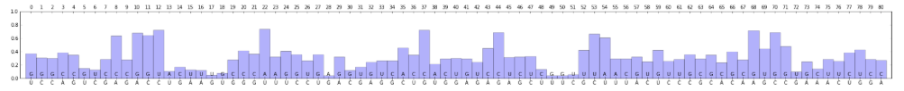

[](https://zenodo.org/badge/latestdoi/74471783)

# RaSE - RNA structurAl Stability Estimator
RaSE is a python program that uses the graph vectorization technique of [EDeN](https://github.com/fabriziocosta/EDeN) to compute a score indicative of the structural stability responsibility of each nucleotide in an RNA sequence. The score is computed as the similarity of the structure obtained by changing a single nucleotide with respect to the original structure. Out of the 3 possible alternatives, only the one which yields the largest difference is reported. The problem of assessing the similarity between two structures is cast in the equivalent problem of assessing the similarity between two graphs which encode the structural information. Structures are computed using the [RNAplfold](https://www.tbi.univie.ac.at/RNA/RNAplfold.1.html) program. The graph embedding represents nucleotides as nodes labeled with the one letter code (A|C|G|U); relations between backbone bounds and base pairs with a probability higher than --hard_threshold are repersented as conjunctive edges, relations between base pairs with probability in the interval --avg_bp_prob_cutoff and --hard_threshold are represented as disjunctive edges. Graphs are transformed into a high dimensional saprse vector representation using the graph vectorization technique of [EDeN](https://github.com/fabriziocosta/EDeN). The similarity between the corresponding vectors is then computed as the [cosine similarity](https://en.wikipedia.org/wiki/Cosine_similarity).


## Input
RaSe takes in input a RNA sequence as a single string of one letter code (A|C|G|U). The string can be provided via stdin or via the -i flag.


## Output
RaSe outputs to stdout a space separated tabular file with the following format: the first line contains the Minimum Free Energy structure (MFE) in dotbracket notation of the original sequence; the following lines contain the nucleotide (nt) position, the nt one letter code (A|C|G|U), the nt code for the mutation that most changes the computed structure, the similarity score between the original structure and the structure obtained by the mutation, the MFE structure of the mutated sequence in dotbracket notation and an optional character * marking the top dissimilar cases.  

```
             (((((((((((.((.......)).))))..............((((((...))))))(((((.......)))))))))))).
  0 G C 0.63 ((((.((((((.((.......)).)))))).)))).......((((((...))))))(((((.......)))))........ 
  1 C G 0.23 (((((((.((((((((.........((((((.......))))))..))))))))...(((((.......)))))))))))). *
```
RaSE can optionally produce image files in various formats (jpg, png, svg, pdf). When invoked with the flag --draw the following files are produced: structure.[format], plot.[format], structures.[format] 

The structure image depicts the graph encoding of the most probable RNA structure: edges between backbone bounds and base pairs with a probability higher than --hard_threshold are displayed with a solid line, edges between base pairs with probability in the interval --avg_bp_prob_cutoff and --hard_threshold are displayed with a dashed line. The node label is composed of the original nt (above) and the mutation that most changes the computed structure (below). The color intensity is proportional to 1 - similarity, so that darker nodes are the ones that have the largest effect on the structure.

<p align="center"></p>

The plot image depicts the nt position on the top x axis, the original nt on the bottom x axis, the mutation that most changes the computed structure on the bottom x axis but inside the plot, the score = 1 - similarity on the y axis, so that the highest bar corresponds to the mutation that has the largest effect on the structure.

<p align="center"></p>

The structures image depicts the graph encoding of the individual k mutations that most changes the computed structure. The title associated with each graph is composed of the original nt, the position and the mutation that most changes the computed structure.

<p align="center"></p>

## Library
RaSE exposes several functions that can be used inside other projects. See examples of use in the 
 [Jupyter notebook](https://github.com/fabriziocosta/RaSE/blob/master/RNAStructuralStabilityEstimator.ipynb)

## Example

```
echo 'UCCAGUCGAGACCUGAAGUGGGUUUCCUGACGAGGCUGUGGAGAGAGCUUUCGCUUUACUCCCGCACAAGCCGAAACUGGA' | ./RaSE.py
             ((((((.(((((((.....))))))).......(((((((((((((((....))))).))))...)).))))...))))))
  0 U G 0.63 .(((((.(((((((.....))))))).......(((((((((((((((....))))).))))...)).))))...))))). 
  1 C G 0.70 ....((((((((((.....)))))))..)))..(((((((((((((((....))))).))))...)).))))......... 
  2 C G 0.70 ....((((((((((.....)))))))..)))..(((((((((((((((....))))).))))...)).))))......... 
  3 A C 0.61 ...(((((((((((.....)))))))..)))).(((((((((((((((....))))).))))...)).))))......... 
  4 G C 0.65 ((((((((.....)).))))))..(((......(((((((((((((((....))))).))))...)).))))......))) 
  5 U G 0.85 ((((((.(((((((.....))))))))......(((((((((((((((....))))).))))...)).))))....))))) 
  6 C U 0.87 ((((((((((((((.....))))))).......(((((((((((((((....))))).))))...)).))))..))))))) 
  7 G C 0.71 ((((((..((((((.....))))))........(((((((((((((((....))))).))))...)).))))...)))))) 
  8 A C 0.36 ((((((..((((((.....))))..(((....))).((((((((((((....))))).)).))))).....))..)))))) 
  9 G C 0.72 ((((((.((.((((.....)))).)).......(((((((((((((((....))))).))))...)).))))...)))))) 
 10 A G 0.32 ((((((...(((.((..(((((......(.(((((((.(....).))).)))))......))))).)).)))...)))))) 
 11 C G 0.36 ((((((...(.(((...(((((......(.(((((((.(....).))).)))))......)))))...))))...)))))) 
 12 C U 0.28 ((((((((.(.((((..(((((......(.(((((((.(....).))).)))))......))))).))))))))..))))) *
 13 U A 0.90 ((((((.((((((.......)))))).......(((((((((((((((....))))).))))...)).))))...)))))) 
 14 G C 0.83 ((((((.(((((((.....))))))).......(((((((((((((((....))))).))))...)).))))...)))))) 
 15 A U 0.87 ((((((.(((((((.....))))))).......(((((((((((((((....))))).))))...)).))))...)))))) 
 16 A U 0.88 ((((((.(((((((.....))))))).......(((((((((((((((....))))).))))...)).))))...)))))) 
 17 G U 0.95 ((((((.(((((((.....))))))).......(((((((((((((((....))))).))))...)).))))...)))))) 
 18 U G 0.92 ((((((.(((((((.....))))))).......(((((((((((((((....))))).))))...)).))))...)))))) 
 19 G C 0.72 ((((((.((((((.......)))))).......(((((((((((((((....))))).))))...)).))))...)))))) 
 20 G C 0.58 ((((((.((((((......).))))).......(((((((((((((((....))))).))))...)).))))...)))))) 
 21 G C 0.64 ((((((.((((((......)).)))).......(((((((((((((((....))))).))))...)).))))...)))))) 
 22 U A 0.26 ((((((.((..((......))..))........(((((((((((((((....))))).))))...)).))))...)))))) *
 23 U A 0.68 ((((((.((.((((.....)))).)).......(((((((((((((((....))))).))))...)).))))...)))))) 
 24 U G 0.59 ((((((...(((((.....)))))((((....))))((((((((((((....))))).)).))))).........)))))) 
 25 C G 0.65 ((((((..((((((.....))))))........(((((((((((((((....))))).))))...)).))))...)))))) 
 26 C U 0.74 ((((((.(((((((.....))))))).......(((((((((((((((....))))).))))...)).))))...)))))) 
 27 U G 0.64 ((((((.(((((((.....)))))))(((.....((.(.(((((((((....))))).))))))).....)))..)))))) 
 28 G A 0.96 ((((((.(((((((.....))))))).......(((((((((((((((....))))).))))...)).))))...)))))) 
 29 A G 0.68 ((((((.(((((((.....))))))).((((..(((.(.(((((((((....))))).))))))).)..))))..)))))) 
 30 C G 0.88 ((((((.(((((((.....))))))).......(((((((((((((((....))))).))))...)).))))...)))))) 
 31 G U 0.83 ((((((.(((((((.....))))))).......(((((((((((((((....))))).))))...)).))))...)))))) 
 32 A G 0.76 ((((((.(((((((.....))))))).......(((((((((((((((....))))).))))...)).))))...)))))) 
 33 G U 0.74 ((((((.(((((((.....))))))).......(((.(.(((((((((....))))).)))))))).........)))))) 
 34 G C 0.74 ((((((.(((((((.....)))))))....((.((.((((((((((((....))))).))))...))).))))..)))))) 
 35 C A 0.54 ((((((...(((((.....)))))((((....))))((((((((((((....))))).)).))))).........)))))) 
 36 U C 0.65 ((((((.(((((((.....))))))).......(((((.(((((((((....))))).)))))).....)))...)))))) 
 37 G C 0.28 ((((((.(((((((.....))))))).......(((((.(((((((((....))))).)))).)....))))...)))))) *
 38 U A 0.79 ((((((.(((((((.....))))))).......((((..(((((((((....))))).))))......))))...)))))) 
 39 G C 0.71 ((((((.(((((((.....))))))).......((((((((.((((((....)))...))).)).)).))))...)))))) 
 40 G U 0.70 ((((((.(((((((.....))))))).......(((((((((((((((....))))).))...)))).))))...)))))) 
 41 A G 0.71 ((((((.(((((((.....))))))).......(((((((((((((((....)))...))))).))).))))...)))))) 
 42 G U 0.76 ((((((.(((((((.....))))))).......((((((((.((((((....))))))...))))...))))...)))))) 
 43 A C 0.55 ((((((.(((((((.....))))))).((.((.((..(((((((((....))))))))).)))))).........)))))) 
 44 G C 0.31 ((((((((.(.(.((..(((((......(.(((((((((....))))).)))))......))))).)).)))))..))))) *
 45 A U 0.69 ((((((.(((((((.....))))))).......((((((((.((((((....))...))))))))...))))...)))))) 
 46 G C 0.68 ((((((.(((((((.....))))))).......((((((((.(((.............)))))))...))))...)))))) 
 47 C U 0.67 ((((((.(((((((.....))))))).......(((((((((((((((....))))).))))...)).))))...)))))) 
 48 U C 0.86 ((((((.(((((((.....))))))).......(((((((((((((((....))))).))))...)).))))...)))))) 
 49 U G 0.96 ((((((.(((((((.....))))))).......(((((((((((((((....))))).))))...)).))))...)))))) 
 50 U G 0.96 ((((((.(((((((.....))))))).......(((((((((((((((....))))).))))...)).))))...)))))) 
 51 C U 0.94 ((((((.(((((((.....))))))).......(((((((((((((((....))))).))))...)).))))...)))))) 
 52 G U 0.58 ((((((.(((((((.....))))))).((.((.((..(((((((((....))))))))).)))))).........)))))) 
 53 C U 0.34 ((((((.(((((((.....))))))).......(((((((((((((((....))))).))))...)).))))...)))))) 
 54 U A 0.39 ((((((.(((((((.....))))))).......((((((((.(((.((....))....)))))))...))))...)))))) 
 55 U A 0.71 ((((((.(((((((.....))))))).......((((((((.((((((....)))...)))))))...))))...)))))) 
 56 U C 0.71 ((((((.(((((((.....))))))).......((((((((.((((((....)))...)))))))...))))...)))))) 
 57 A G 0.68 ((((((.(((((((.....))))))).......(((((((((((((((....))))).))))...)).))))...)))))) 
 58 C U 0.75 ((((((.(((((((.....))))))).......(((((((((((((((....))))).))))...)).))))...)))))) 
 59 U G 0.58 ((((((.(((((((.....))))))).......((((((((.((((((....))))).)..))))...))))...)))))) 
 60 C U 0.74 ((((((.(((((((.....))))))).......(((((((((((((((....))))).).)))))...))))...)))))) 
 61 C U 0.71 ((((((.(((((((.....))))))).......(((((((((((((((....)))...))))).))).))))...)))))) 
 62 C G 0.64 ((((((.(((((((.....))))))).......(((((((((((((((....))))).))))...)).))))...)))))) 
 63 G C 0.71 ((((((.(((((((.....))))))).......(((((((((((((((....))))).))))...)).))))...)))))) 
 64 C G 0.65 ((((((.(((((((.....))))))).......(((((((((((((((....))))).))))...)).))))...)))))) 
 65 A C 0.76 ((((((.(((((((.....))))))).......(((((((((((((((....))))).)).))))...))))...)))))) 
 66 C G 0.60 ((((((..((((((.....))))))(((....)))(((((((((((((....))))).)).))))))........)))))) 
 67 A C 0.72 ((((((.(((((((.....))))))).......(((((.(((((((((....))))).)))).....)))))...)))))) 
 68 A G 0.28 ((((((.(((((((.....)))))))....((.(.(((((((((((((....))))).))))...)))).)))..)))))) *
 69 G U 0.56 ((((((.(((((((.....)))))))....((.((.((((((((((((....))))).))))...))).))))..)))))) 
 70 C G 0.32 ((((((..((((((.....))))))(((....)))....(((((((((....))))).))))(((.....)))..)))))) *
 71 C G 0.52 ((((((..((((((.....))))))(((....))).....((((((((....))))).)))((((....))))..)))))) 
 72 G U 0.90 ((((((.(((((((.....)))))))......((((((((((((((((....))))).))))...)).)))))..)))))) 
 73 A G 0.75 ((((((.(((((((.....))))))).......(((((((((((((((....))))).))))...)).))))...)))))) 
 74 A C 0.86 ((((((.(((((((.....))))))).......(((((((((((((((....))))).))))...)).))))...)))))) 
 75 A U 0.71 (((((..(((((((.....))))))).......(((((((((((((((....))))).))))...)).))))....))))) 
 76 C U 0.74 ((((((((((((((.....)))))))..)))..(((((((((((((((....))))).))))...)).)))).....)))) 
 77 U C 0.61 .((.((((((((((.....)))))))..)))..)).((((((((((((....))))).)).)))))....(((....))). 
 78 G U 0.57 ....((((((((((.....)))))))..)))..(((((((((((((((....))))).))))...)).))))......... 
 79 G C 0.72 ....((((((((((.....)))))))..)))..(((((((((((((((....))))).))))...)).))))......... 
 80 A C 0.73 .(((((.(((((((.....))))))).......(((((((((((((((....))))).))))...)).))))...))))). 
```

## Help

```
RaSE - RNA structurAl Stability Estimate.

Compute stability.

Version: 1.1
Author: Fabrizio Costa [costa@informatik.uni-freiburg.de]

Usage:
  RaSE [-i <sequence>]
       [-k N] [-c N, --complexity=N] [-n N, --nbits=N] [-w N, --window_size=N]
       [-b N, --max_bp_span=N] [-p N, --avg_bp_prob_cutoff=N]
       [-r N, --hard_threshold=N] [-e N, --max_num_edges=N]
       [-l, --no_lonely_bps] [-t, --no_nesting]
       [--draw] [--jpg | --svg | --png | --pdf]
       [--verbose]
  RaSE (-h | --help | --version)

Options:
  -i <sequence>                     Specify input sequence [default: stdin].
  -k N                              Specify number of maximally unstable
                                    nucleotides to mark [default: 5].
  -c N, --complexity=N              Complexity of features [default: 3].
  -n N, --nbits=N                   Num bits to represent all possible feature
                                    pseudo identifiers [default: 15].
  -w N, --window_size=N             Window size [default: 150]
  -b N, --max_bp_span=N             Max number of spanning bases [default: 130]
  -p N, --avg_bp_prob_cutoff=N      Average probability cutoff [default: 0.1]
  -r N, --hard_threshold=N          Hard threshold [default: 0.5]
  -e N, --max_num_edges=N           Max num edges [default: 2]
  -l, --no_lonely_bps               Flag to activate no lonely base pairs mode.
  -t, --no_nesting                  Flag to activate no nesting mode.
  --draw                            Output drawing with standard name out.pdf.
  --jpg                             Save images in jpg format.
  --svg                             Save images in svg format.
  --png                             Save images in png format.
  --pdf                             Save images in pdf format.
  -h --help                         Show this screen.
  --version                         Show version.
  --verbose                         Print more text.

```
